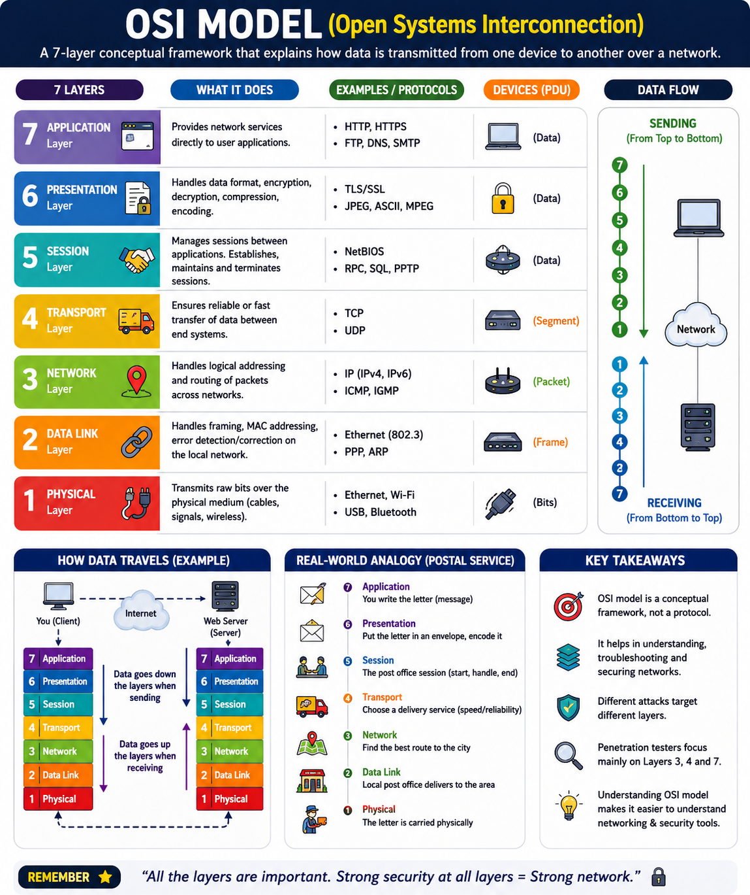

# Phase 1 — Networking Fundamentals



# Concept 2: OSI Model (Open Systems Interconnection)

## Definition

The OSI (Open Systems Interconnection) Model is a conceptual framework that explains how data travels from one device to another over a network.

Instead of sending data directly from one computer to another, the communication process is divided into seven layers. Each layer has a specific responsibility and passes data to the next layer.

The OSI model helps engineers, developers, and penetration testers understand where communication happens and where security vulnerabilities may exist.

---

## Why the OSI Model Exists

Imagine building a city-wide delivery system. One team writes the address, another packages the parcel, another transports it, and another delivers it.

Networking works similarly. Breaking communication into layers makes systems easier to build, debug, and secure.

The OSI model provides:

* Standardization
* Easier troubleshooting
* Better interoperability
* Security analysis
* Clear separation of responsibilities

---

# The Seven Layers

```text
7. Application
6. Presentation
5. Session
4. Transport
3. Network
2. Data Link
1. Physical
```

While sending data:

```text
Application → Physical
```

While receiving data:

```text
Physical → Application
```

---

## Layer 7 — Application Layer

### Purpose

Provides network services directly to user applications.

This is the layer closest to the user.

### Common Protocols

* HTTP
* HTTPS
* FTP
* DNS
* SMTP

### Examples

* Chrome
* Firefox
* WhatsApp
* Outlook

### Real-Life Example

Typing:

```text
https://google.com
```

creates an HTTP request at the Application Layer.

### VAPT Relevance

Most web attacks occur here:

* SQL Injection
* XSS
* CSRF
* SSRF
* IDOR

Tools:

* Burp Suite
* OWASP ZAP

---

## Layer 6 — Presentation Layer

### Purpose

Ensures that both systems understand the data format.

Responsibilities:

* Encryption
* Decryption
* Compression
* Encoding

### Real-Life Example

Think of a translator between two people speaking different languages.

### Example

HTTPS encrypts data before transmission.

### VAPT Relevance

Related topics:

* TLS
* SSL certificates
* HTTPS interception

---

## Layer 5 — Session Layer

### Purpose

Creates, maintains, and terminates communication sessions.

### Responsibilities

* Start sessions
* Keep sessions active
* End sessions

### Real-Life Example

A phone call:

* Call starts.
* Conversation happens.
* Call ends.

### VAPT Relevance

Common attacks:

* Session hijacking
* Session fixation
* Cookie theft

---

## Layer 4 — Transport Layer

### Purpose

Ensures reliable communication between applications.

### Main Protocols

* TCP
* UDP

### Responsibilities

* Data segmentation
* Reliability
* Flow control
* Error detection

### Real-Life Example

Sending a 500-page book in multiple packages and reassembling it at the destination.

### VAPT Relevance

Used heavily during:

* Port scanning
* Service enumeration
* Firewall analysis

Tools:

* Nmap
* Netcat

---

## Layer 3 — Network Layer

### Purpose

Determines where data should be delivered.

### Main Protocol

* IP (Internet Protocol)

### Devices

* Routers

### Responsibilities

* Logical addressing
* Routing
* Packet forwarding

### Example

```text
192.168.1.100
```

is an IP address.

### Real-Life Example

A courier uses your home address to locate your building.

### VAPT Relevance

Used during:

* Host discovery
* Network mapping
* Routing analysis

Tools:

* Nmap
* Traceroute

---

## Layer 2 — Data Link Layer

### Purpose

Transfers data between devices on the same local network.

### Main Concept

Uses MAC addresses.

### Devices

* Switches

### Responsibilities

* Frame creation
* MAC addressing
* Error detection

### Real-Life Example

The apartment number inside a building.

### VAPT Relevance

Common attacks:

* ARP spoofing
* MAC flooding

Tools:

* Wireshark
* Ettercap

---

## Layer 1 — Physical Layer

### Purpose

Transmits raw bits through physical media.

### Examples

* Ethernet cables
* Fiber optics
* Wi-Fi signals

### Responsibilities

* Electrical transmission
* Optical transmission
* Radio transmission

### Real-Life Example

Roads carrying vehicles.

### VAPT Relevance

Examples:

* Rogue devices
* Hardware implants
* Physical intrusion

---

# Data Flow Example

Suppose you visit:

```text
https://chat.openai.com
```

The request travels:

```text
Application
    ↓
Presentation
    ↓
Session
    ↓
Transport
    ↓
Network
    ↓
Data Link
    ↓
Physical
```

The server processes the request and sends the response back in reverse order.

---

# Layer-wise Security Focus

| Layer        | Example Attack    |
| ------------ | ----------------- |
| Application  | SQL Injection     |
| Presentation | Weak TLS          |
| Session      | Session Hijacking |
| Transport    | SYN Flood         |
| Network      | IP Spoofing       |
| Data Link    | ARP Spoofing      |
| Physical     | Rogue Device      |

---

# VAPT Perspective

Different cybersecurity tools operate at different layers:

| Tool       | Primary Layer   |
| ---------- | --------------- |
| Burp Suite | Layer 7         |
| Wireshark  | Layers 2–7      |
| Nmap       | Layers 3–4      |
| Netcat     | Layer 4         |
| Metasploit | Multiple Layers |

Understanding the OSI model helps a penetration tester understand how these tools work internally.

---

# Memory Trick

Think of opening a website:

* Application → "I want to visit Google."
* Presentation → "Encrypt the data."
* Session → "Keep me logged in."
* Transport → "Deliver the data reliably."
* Network → "Find Google's IP address."
* Data Link → "Send it to the next device."
* Physical → "Transmit the bits."

---

# Key Takeaways

* The OSI model divides communication into seven layers.
* Each layer performs a specific task.
* Data travels from Layer 7 to Layer 1 while sending.
* Data travels from Layer 1 to Layer 7 while receiving.
* Most web application penetration testing focuses on Layers 3, 4, and 7.

---

# Interview Answer

**What is the OSI model?**

The OSI model is a seven-layer conceptual framework that explains how data is transmitted between devices over a network. Each layer has specific responsibilities, such as routing, encryption, session management, and application communication, making networks easier to design, troubleshoot, and secure.
