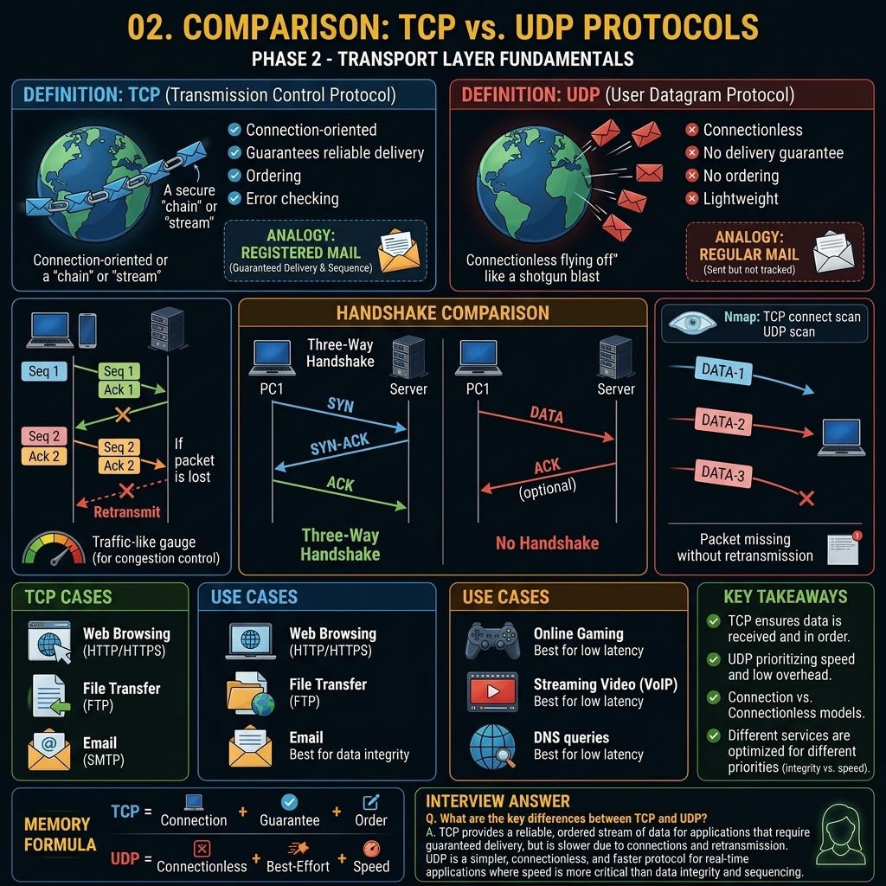

# Phase 1 — Networking Fundamentals



# Concept 3: TCP vs UDP (Transport Layer Protocols)

## Definition and Core Concepts

At the Transport Layer (Layer 4) of the OSI model, data is transmitted primarily using two distinct protocols: **TCP (Transmission Control Protocol)** and **UDP (User Datagram Protocol)**. Both protocols are used to send bits of data—known as packets or segments—over the Internet, but they operate in fundamentally different ways, serving different purposes depending on the application's requirements.

* **TCP** is the protocol of reliability. It guarantees that all data sent will be received exactly as it was intended, in the correct order, without any missing pieces.
* **UDP** is the protocol of speed. It sends data as fast as possible without caring whether the data actually reaches the destination or in what order it arrives.

Understanding the difference between these two protocols is fundamental to both network engineering and offensive cybersecurity (VAPT), as the behavior of these protocols dictates how applications are designed, how they fail, and how they can be exploited.

---

## Transmission Control Protocol (TCP) in Depth

TCP is a **connection-oriented** protocol. This means a formal connection must be established between the sender and receiver before any data is transferred.

### The TCP Header Structure
The TCP header is complex, typically 20 bytes long (up to 60 bytes with options). This overhead is what provides TCP's reliability.

```text
 0                   1                   2                   3
 0 1 2 3 4 5 6 7 8 9 0 1 2 3 4 5 6 7 8 9 0 1 2 3 4 5 6 7 8 9 0 1
+-+-+-+-+-+-+-+-+-+-+-+-+-+-+-+-+-+-+-+-+-+-+-+-+-+-+-+-+-+-+-+-+
|          Source Port          |       Destination Port        |
+-+-+-+-+-+-+-+-+-+-+-+-+-+-+-+-+-+-+-+-+-+-+-+-+-+-+-+-+-+-+-+-+
|                        Sequence Number                        |
+-+-+-+-+-+-+-+-+-+-+-+-+-+-+-+-+-+-+-+-+-+-+-+-+-+-+-+-+-+-+-+-+
|                    Acknowledgment Number                      |
+-+-+-+-+-+-+-+-+-+-+-+-+-+-+-+-+-+-+-+-+-+-+-+-+-+-+-+-+-+-+-+-+
|  Data |           |U|A|P|R|S|F|                               |
| Offset| Reserved  |R|C|S|S|Y|I|            Window             |
|       |           |G|K|H|T|N|N|                               |
+-+-+-+-+-+-+-+-+-+-+-+-+-+-+-+-+-+-+-+-+-+-+-+-+-+-+-+-+-+-+-+-+
|           Checksum            |         Urgent Pointer        |
+-+-+-+-+-+-+-+-+-+-+-+-+-+-+-+-+-+-+-+-+-+-+-+-+-+-+-+-+-+-+-+-+
|                    Options                    |    Padding    |
+-+-+-+-+-+-+-+-+-+-+-+-+-+-+-+-+-+-+-+-+-+-+-+-+-+-+-+-+-+-+-+-+
|                             data                              |
+-+-+-+-+-+-+-+-+-+-+-+-+-+-+-+-+-+-+-+-+-+-+-+-+-+-+-+-+-+-+-+-+
```

#### Key TCP Header Fields:
1. **Source/Destination Port (16 bits each):** Identifies the sending and receiving applications.
2. **Sequence Number (32 bits):** Used to keep track of the data sent. Ensures data can be reassembled in the correct order.
3. **Acknowledgment Number (32 bits):** Used by the receiver to inform the sender that data was successfully received.
4. **Flags (Control Bits):** 
   * `URG` (Urgent): Data should be prioritized.
   * `ACK` (Acknowledgment): Acknowledgment number is valid.
   * `PSH` (Push): Push data to the application layer immediately.
   * `RST` (Reset): Abruptly reset the connection.
   * `SYN` (Synchronize): Initiate a connection.
   * `FIN` (Finish): Terminate a connection gracefully.
5. **Window Size:** Indicates how much data the receiver is willing to accept (used for flow control).
6. **Checksum:** Error-checking to ensure header and data integrity.

### Characteristics of TCP
* **Reliable Delivery:** If a packet is lost, TCP will automatically retransmit it.
* **Ordered Delivery:** Packets may arrive out of order, but TCP will sequence them correctly before passing them to the application.
* **Flow Control:** TCP prevents a fast sender from overwhelming a slow receiver by adjusting the Window Size.
* **Congestion Control:** TCP detects network congestion and slows down its transmission rate to prevent network collapse.
* **High Overhead:** The constant acknowledgments and 20-byte headers make TCP slower and more bandwidth-intensive than UDP.

### Real-World Use Cases for TCP
TCP is used whenever data integrity is more important than speed.
* **Web Browsing (HTTP/HTTPS):** You want to load the entire webpage, not half of it.
* **Email (SMTP/IMAP/POP3):** A missing sentence in an email is unacceptable.
* **File Transfers (FTP/SFTP/SMB):** A corrupted binary file will not execute.
* **Secure Shell (SSH):** Every keystroke must be reliably transmitted.

---

## User Datagram Protocol (UDP) in Depth

UDP is a **connectionless** protocol. It acts like a firehose, blasting data at the destination without checking if the destination is ready to receive it, or if it actually arrived.

### The UDP Header Structure
The UDP header is incredibly simple and lightweight—only 8 bytes long.

```text
 0      7 8     15 16    23 24    31
+--------+--------+--------+--------+
|     Source      |   Destination   |
|      Port       |      Port       |
+--------+--------+--------+--------+
|                 |                 |
|     Length      |    Checksum     |
+--------+--------+--------+--------+
|                                   |
|          data octets ...          |
+-----------------------------------+
```

#### Key UDP Header Fields:
1. **Source/Destination Port:** Identifies applications (same as TCP).
2. **Length:** The length of the UDP header and data combined.
3. **Checksum:** Optional error checking (if it fails, the packet is silently dropped).

### Characteristics of UDP
* **Unreliable Delivery:** There is no acknowledgment that data was received. Lost packets are gone forever.
* **Unordered Delivery:** Packets are passed to the application in the exact order they arrive, even if they are out of sequence.
* **No Flow/Congestion Control:** UDP will send data as fast as the application generates it, regardless of network conditions.
* **Low Overhead:** With only an 8-byte header and no connection setup or acknowledgments, UDP is extremely fast and efficient.

### Real-World Use Cases for UDP
UDP is used whenever speed is prioritized over perfect data integrity.
* **Video/Audio Streaming (Zoom, Netflix, YouTube):** Dropping a single frame of video is preferable to the video pausing to retransmit a lost packet from 3 seconds ago.
* **Online Gaming:** You want your character's current position to be updated instantly. Receiving a delayed packet about where your character was 2 seconds ago is useless.
* **DNS (Domain Name System):** DNS queries need to be lightning fast. Setting up a TCP connection just to ask "What is the IP of google.com?" takes too long.
* **DHCP (Dynamic Host Configuration Protocol):** Used to quickly broadcast requests for an IP address upon joining a network.
* **VoIP (Voice over IP):** Live phone calls prioritize real-time delivery over perfect audio quality.

---

## Comparative Analysis: TCP vs UDP

| Feature | TCP (Transmission Control Protocol) | UDP (User Datagram Protocol) |
| :--- | :--- | :--- |
| **Connection Type** | Connection-oriented (requires 3-way handshake) | Connectionless (fire and forget) |
| **Reliability** | Highly reliable (guaranteed delivery) | Unreliable (best-effort delivery) |
| **Ordering** | Ordered (sequences packets correctly) | Unordered (as they arrive) |
| **Speed** | Slower (due to overhead and acknowledgments) | Very fast (minimal overhead) |
| **Header Size** | 20 to 60 bytes | 8 bytes |
| **Error Checking** | Checksum + Retransmission of lost packets | Checksum only (drops corrupt packets) |
| **Flow Control** | Yes (Windowing) | No |
| **Congestion Control** | Yes | No |
| **Broadcast/Multicast** | Not supported (unicast only) | Supported |
| **Common Protocols** | HTTP, HTTPS, FTP, SSH, SMTP | DNS, DHCP, TFTP, SNMP, VoIP |

---

## VAPT Perspective: Scanning and Exploitation

In Penetration Testing, the differences between TCP and UDP drastically alter how an attacker performs reconnaissance and scanning.

### TCP Port Scanning
Because TCP requires a formalized connection, scanning it is highly reliable.
* **TCP Connect Scan (`nmap -sT`):** The scanner completes the full 3-way handshake. It is highly accurate but very noisy and easily logged by firewalls and IDSs.
* **TCP SYN Scan / Stealth Scan (`nmap -sS`):** The scanner sends a SYN packet. If the target replies with a SYN-ACK, the port is open. The scanner then sends an RST to tear down the connection before it is logged by the application layer. This is the default Nmap scan.

### UDP Port Scanning
Scanning UDP is notoriously difficult, slow, and unreliable.
* **UDP Scan (`nmap -sU`):** Because UDP is connectionless, if you send a UDP packet to an open port, the application usually just consumes it and sends nothing back. 
* Therefore, **No Response = Open or Filtered (by a firewall)**.
* If you send a UDP packet to a closed port, the operating system *should* respond with an **ICMP Port Unreachable** message. 
* Therefore, **ICMP Response = Closed**.
* Because scanners have to wait for timeouts to determine if a port is "Open/Filtered," UDP scans can take hours compared to seconds for a TCP scan.

### Denial of Service (DoS) Vectors
* **TCP SYN Flood:** Attackers send thousands of TCP SYN packets to a server but never complete the handshake. The server allocates memory for these half-open connections until it crashes.
* **UDP Flood:** Attackers blast massive amounts of UDP traffic at a target, consuming all available network bandwidth.
* **UDP Amplification Attacks:** Because UDP is connectionless, attackers can spoof their source IP address. They send a small query to a vulnerable UDP server (like DNS or NTP) with the victim's spoofed IP. The server sends a massive response to the victim, amplifying the attacker's bandwidth capabilities.

---

## Troubleshooting Tools

Network engineers and pentesters frequently use command-line tools to analyze TCP and UDP traffic.

### Netstat / SS
Used to view active TCP and UDP connections on a local machine.
```bash
# View all listening TCP and UDP ports
netstat -tulpn
ss -tulpn
```

### Tcpdump / Wireshark
Used for packet sniffing. You can filter specifically for TCP or UDP traffic.
```bash
# Capture only TCP traffic on port 80
tcpdump -i eth0 tcp port 80

# Capture only UDP traffic on port 53 (DNS)
tcpdump -i eth0 udp port 53
```

---

## Real-World Analogy: The Postal System

To easily remember the difference:

**TCP is like Certified Mail.**
You send a letter. The postman hands it directly to the recipient, asks for a signature, and brings the receipt back to you. If the letter is lost, the post office notifies you, and you send it again. You are 100% sure it arrived.

**UDP is like a standard Postcard.**
You drop it in the mailbox. You hope it gets there. If it gets lost in transit, nobody tells you, and the recipient never knows they missed a postcard. But it's much faster and cheaper to send.

---

## Edge Cases and Modern Implementations

While the distinction between TCP (reliability) and UDP (speed) is absolute, modern applications sometimes blur the lines by building TCP-like reliability on top of UDP.

### HTTP/3 and QUIC
Historically, all web traffic (HTTP) ran over TCP. However, TCP's connection overhead (especially when combined with TLS encryption handshakes) introduces significant latency. 
Google developed the **QUIC** protocol, which now forms the basis of **HTTP/3**. 
QUIC runs entirely over **UDP**. It builds its own reliability, sequencing, and encryption layers directly into the protocol, bypassing TCP entirely. This provides the speed of UDP with the reliability of TCP, drastically speeding up modern web browsing.

### Video Buffering
If video streaming uses UDP, why does Netflix "buffer"?
Netflix actually uses TCP for video streaming. Because it is pre-recorded Video-on-Demand (VoD), a few seconds of buffering allows TCP to download chunks of video reliably. 
Conversely, live video calls (Zoom, Skype) use UDP because they cannot afford the latency of buffering; real-time interaction is more important than perfect picture quality.

---

## Key Takeaways

* **TCP** is connection-oriented, reliable, ordered, and slower. It uses a 3-way handshake.
* **UDP** is connectionless, unreliable, unordered, and extremely fast. It is a "fire-and-forget" protocol.
* TCP handles its own error correction via retransmissions; UDP relies on the application layer to handle dropped data if necessary.
* TCP scanning is fast and accurate; UDP scanning is slow and relies on ICMP error messages.
* Modern protocols like HTTP/3 use UDP to maximize speed while implementing custom reliability mechanisms.

---

## Memory Formula

```text
TCP = Telephone Call (Establish connection, talk, acknowledge, hang up)
UDP = Megaphone (Shout into the void, hope someone hears it)
```

---

## Interview Questions & Answers

**Q: What is the primary difference between TCP and UDP?**
**A:** The primary difference is reliability and connection state. TCP is a connection-oriented protocol that guarantees delivery, ordering, and error-checking via a 3-way handshake and acknowledgments. UDP is a connectionless, best-effort protocol that sends data without establishing a connection or verifying receipt, making it significantly faster but unreliable.

**Q: Why does DNS primarily use UDP instead of TCP?**
**A:** DNS uses UDP for standard queries because speed is critical. A standard DNS query and response fits within a single UDP packet. Establishing a TCP 3-way handshake for a simple query would triple the time required to resolve a domain name. However, DNS will fall back to TCP for Zone Transfers or if the response payload exceeds 512 bytes.

**Q: Explain how a UDP port scan works if UDP does not respond to open ports.**
**A:** UDP port scanning relies on negative responses. When a scanner sends a UDP packet to an open port, the application usually consumes it without replying, resulting in a timeout. However, if the packet is sent to a closed port, the target's operating system generates an "ICMP Port Unreachable" (Type 3, Code 3) error message. By tracking which ports return ICMP errors, the scanner can infer that the ports which timed out are likely open or filtered by a firewall.
