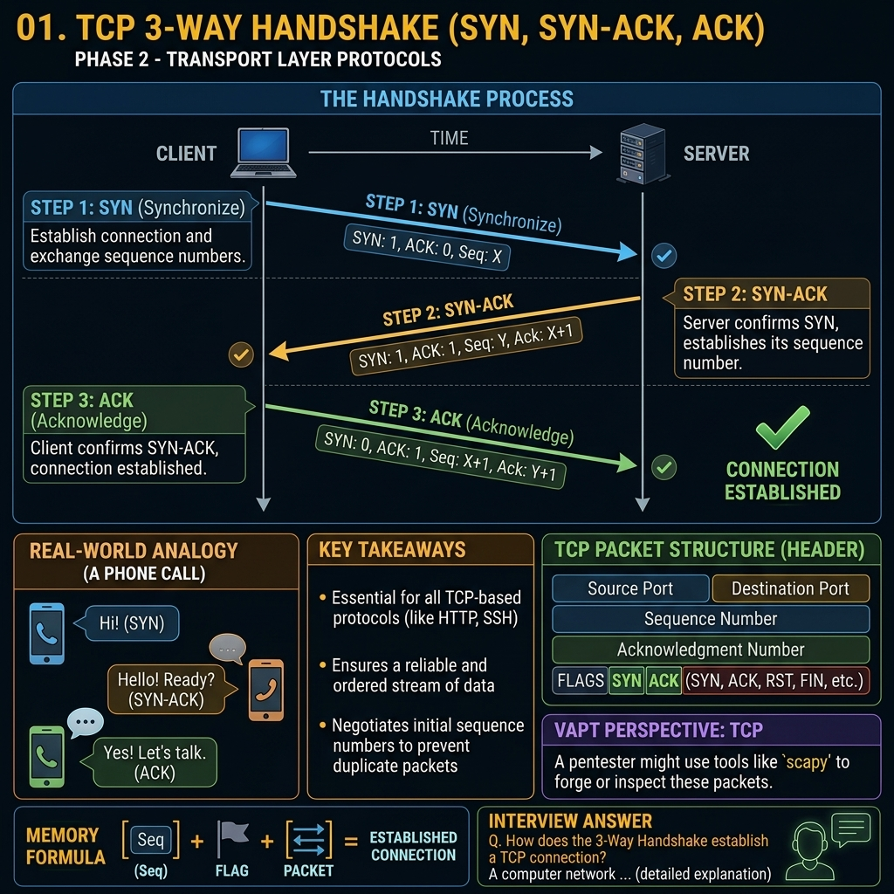

# Phase 1 — Networking Fundamentals

<<<<<<< HEAD
# Concept 4: TCP Three-Way Handshake

## Definition

The TCP Three-Way Handshake is the process used by TCP to establish a connection between a client and a server before exchanging data.

It ensures that both sides are ready to communicate.

---

# Why Do We Need It?

Before sending sensitive information such as:

* Passwords
* Bank transactions
* Emails
* API requests

both systems must confirm that they can communicate.

---

# The Three Steps

## Step 1: SYN

The client sends:

```text
SYN
```

Meaning:

> "Can we communicate?"

---

## Step 2: SYN-ACK

The server replies:

```text
SYN-ACK
```

Meaning:

> "Yes, I received your request."

---

## Step 3: ACK

The client sends:

```text
ACK
```

Meaning:

> "Great, let's start."

---

# Full Flow

```text
Client                 Server

SYN      ---------->

          <----------   SYN-ACK

ACK      ---------->
```

Connection established.

---

# Real-Life Analogy

Imagine making a phone call:

```text
You: "Hello?"

Friend: "Hello, I can hear you."

You: "Perfect."
```

Only after this conversation starts can you exchange information.

---

# Where Is It Used?

Every TCP service uses the handshake:

* HTTP
* HTTPS
* SSH
* FTP
* Databases

---

# VAPT Perspective

Nmap SYN scans depend on the three-way handshake.

Example:

```bash
nmap -sS target-ip
```

Nmap sends a SYN packet and analyzes the response:

| Response    | Meaning        |
| ----------- | -------------- |
| SYN-ACK     | Port is open   |
| RST         | Port is closed |
| No response | Filtered       |

---

# SYN Flood Attack

An attacker sends thousands of SYN packets but never completes the handshake.

```text
Attacker → SYN
Server → SYN-ACK
```

The server waits for the final ACK and eventually runs out of resources.

This is called a SYN Flood attack.

---

# Memory Trick

```text
SYN

↓

SYN-ACK

↓

ACK
```

Think:

```text
"Can we talk?"

"Yes."

"Okay."
=======


# Concept 4: The TCP 3-Way Handshake

## Definition and Purpose

The **Transmission Control Protocol (TCP)** is inherently connection-oriented. Before any application data (like a webpage, an email, or a file) can be transmitted over a TCP connection, the two communicating devices must first negotiate and establish a formal connection. 

This connection establishment process is known as the **TCP 3-Way Handshake**.

The primary purposes of the 3-Way Handshake are:
1. **Synchronization (SYN):** Both devices must agree on initial sequence numbers to track the data flow and ensure packets can be reordered correctly.
2. **Parameter Negotiation:** The devices agree on connection parameters such as the Maximum Segment Size (MSS) and Window Size for flow control.
3. **Connection Verification:** It proves that both the client and the server are online, reachable, and willing to communicate on the specified port.

Without the 3-Way Handshake, TCP's guaranteed reliability, ordered delivery, and congestion control mechanisms would be impossible to implement.

---

## The Mechanics of the Handshake

The handshake involves three distinct packets exchanged between a Client (the initiator) and a Server (the listener). This process utilizes the Control Flags within the TCP Header, specifically the **SYN** (Synchronize) and **ACK** (Acknowledge) flags.

### Step 1: SYN (Synchronize)
* **Direction:** Client -> Server
* **Action:** The client wants to initiate a connection. It generates a random Initial Sequence Number (e.g., `ISN = 1000`) and sets the `SYN` flag to `1` in the TCP header. 
* **Meaning:** *"Hello Server, I would like to establish a connection with you. My starting sequence number is 1000."*
* **State Change:** The client enters the `SYN-SENT` state.

### Step 2: SYN-ACK (Synchronize-Acknowledge)
* **Direction:** Server -> Client
* **Action:** If the server has the requested port open and is willing to accept the connection, it responds. It generates its own random Initial Sequence Number (e.g., `ISN = 5000`). It also acknowledges the client's SYN by taking the client's ISN and adding 1 to it (`ACK = 1001`). It sets both the `SYN` and `ACK` flags to `1`.
* **Meaning:** *"Hello Client, I acknowledge your request (ACK 1001), and I agree to open a connection. My starting sequence number is 5000."*
* **State Change:** The server enters the `SYN-RECEIVED` state.

### Step 3: ACK (Acknowledge)
* **Direction:** Client -> Server
* **Action:** The client receives the server's SYN-ACK. It acknowledges the server's sequence number by adding 1 to it (`ACK = 5001`). It sets the `ACK` flag to `1`. (At this point, the client may also begin sending actual application data in the same packet).
* **Meaning:** *"Thank you, Server. I acknowledge your sequence number (ACK 5001). The connection is established."*
* **State Change:** Both the Client and the Server enter the `ESTABLISHED` state. Data transmission can now begin.

---

## Visualizing the 3-Way Handshake

```text
    CLIENT                                               SERVER
  (SYN-SENT)                                            (LISTEN)
      |                                                    |
      | ------------- [1. SYN (Seq=1000)] ---------------> |
      |                                                    |
      |                                             (SYN-RECEIVED)
      |                                                    |
      | <------ [2. SYN-ACK (Seq=5000, Ack=1001)] -------- |
      |                                                    |
 (ESTABLISHED)                                             |
      |                                                    |
      | ------------- [3. ACK (Seq=1001, Ack=5001)] -----> |
      |                                                    |
      |                                              (ESTABLISHED)
      |                                                    |
      | ===== [4. DATA TRANSFER BEGINS (HTTP, etc.)] =====>|
```

---

## Why are Sequence Numbers Random?

In the early days of networking, sequence numbers simply started at `1` and incremented. However, this presented a massive security vulnerability known as **TCP Sequence Prediction**.

If an attacker knew the exact sequence numbers being used, they could inject malicious packets into an established TCP connection, hijacking the session (TCP Session Hijacking). For example, an attacker could inject commands into an unencrypted Telnet or FTP session.

To mitigate this, modern operating systems generate highly unpredictable, cryptographically secure random 32-bit numbers for the Initial Sequence Number (ISN) during the handshake. This ensures that an off-path attacker cannot guess the sequence and inject packets.

---

## Connection Termination: The 4-Way Tear Down

Just as a connection must be formally established, it must be formally closed to ensure all data in transit has arrived. This is done using the `FIN` (Finish) flag.

1. **FIN:** Client sends a FIN packet to close its side of the connection.
2. **ACK:** Server acknowledges the client's FIN. (Server can still send remaining data).
3. **FIN:** Server sends its own FIN packet to close its side.
4. **ACK:** Client acknowledges the server's FIN.

Once this 4-step process is complete, the connection is fully terminated, and resources are released.

---

## VAPT Perspective: Exploiting the Handshake

Understanding the 3-way handshake is mandatory for penetration testing. It forms the basis of how we discover open ports, bypass firewalls, and perform Denial of Service attacks.

### 1. TCP Connect Scanning (Nmap `-sT`)
A full TCP Connect scan completes the entire 3-way handshake.
* **Open Port:** SYN -> SYN-ACK -> ACK
* **Closed Port:** SYN -> RST-ACK (Server refuses connection)
* **Filtered Port:** SYN -> (No response, firewall dropped it)
* **Drawback:** Completing the handshake leaves a full connection log on the target server, making this scan highly noisy and easily detectable.

### 2. TCP SYN Scanning / Stealth Scanning (Nmap `-sS`)
This is the default and most popular Nmap scan. It intentionally breaks the handshake.
* **Process:** The scanner sends a SYN. The server replies with a SYN-ACK. The scanner instantly sends an **RST** (Reset) instead of an ACK.
* **Advantage:** Because the handshake is never completed, the application layer (e.g., Apache, Nginx) is never notified of the connection, and nothing is written to the application logs. It is "stealthy" at the application level (though modern IDSs will easily detect it).

### 3. TCP SYN Flood (Denial of Service)
This is a classic resource exhaustion attack.
* **The Attack:** The attacker generates thousands of SYN packets with spoofed source IP addresses and sends them to the victim server.
* **The Effect:** The server replies with SYN-ACKs and allocates memory in a "TCP Backlog Queue" waiting for the final ACK. Because the source IPs are fake, the final ACK never arrives. The server's queue fills up entirely with "half-open" connections, and it becomes incapable of accepting legitimate connections.
* **The Mitigation:** Modern servers use "SYN Cookies" to calculate the SYN-ACK cryptographically without actually allocating memory on the server until the final ACK is received.

### 4. Firewall Evasion: ACK Scanning (Nmap `-sA`)
Sometimes, firewalls block incoming SYN packets to prevent connections from the outside, but they allow ACK packets through (assuming they belong to established outbound connections).
An attacker can send a raw ACK packet.
* If a stateful firewall blocks it, no response is received.
* If the firewall allows it through, the server receives an unexpected ACK and responds with an RST.
This technique doesn't determine if a port is open or closed, but it maps out firewall rules and determines if a firewall is stateful or stateless.

---

## Deep Dive: TCP States

During network troubleshooting, you will often use commands like `netstat` or `ss` to view active connections. You must understand the TCP states displayed in these tools.

* **LISTEN:** The server is waiting for incoming SYN requests.
* **SYN-SENT:** The client sent a SYN and is waiting for a SYN-ACK.
* **SYN-RECEIVED:** The server sent a SYN-ACK and is waiting for the final ACK. (If a server has too many of these, it is likely under a SYN Flood attack).
* **ESTABLISHED:** The 3-way handshake is complete. Normal data transfer.
* **FIN-WAIT / TIME-WAIT:** The connection is in the process of closing.
* **CLOSE-WAIT:** The local application is waiting to close the connection.

---

## Packet Analysis via Wireshark

When analyzing a packet capture (.pcap) in Wireshark, the 3-way handshake is immediately visible at the start of any TCP stream.

To filter for handshake packets, you can use the following Wireshark display filters:
* Find all SYN packets: `tcp.flags.syn == 1 and tcp.flags.ack == 0`
* Find all SYN-ACK packets: `tcp.flags.syn == 1 and tcp.flags.ack == 1`
* View the entire stream: Right-click a packet -> Follow -> TCP Stream.

---

## Key Takeaways

* The TCP 3-Way Handshake guarantees that both devices are ready to communicate before data transmission begins.
* It consists of SYN (Client), SYN-ACK (Server), and ACK (Client).
* Initial Sequence Numbers are randomized to prevent TCP session hijacking.
* Nmap stealth scans (SYN Scans) abort the handshake prematurely using an RST packet to avoid application logging.
* A SYN Flood DoS attack abuses the handshake by leaving connections in a half-open (SYN-RECEIVED) state, exhausting server memory.
* Connection termination requires a 4-step teardown process using the FIN flag.

---

## Memory Formula

```text
The Handshake:
1. "Hello" (SYN)
2. "Hello, I acknowledge you" (SYN-ACK)
3. "I acknowledge you too" (ACK)

The Teardown:
1. "Goodbye" (FIN)
2. "Okay" (ACK)
3. "Goodbye" (FIN)
4. "Okay" (ACK)
>>>>>>> 615badecdf7661df364019b031e3bba3e24173cc
```

---

<<<<<<< HEAD
# Key Takeaways

* TCP uses a three-way handshake before communication.
* The sequence is SYN → SYN-ACK → ACK.
* It ensures both devices are ready.
* Nmap and firewalls rely heavily on this process.
* SYN flood attacks exploit the handshake.

---

# Interview Answer

The TCP Three-Way Handshake is the connection establishment process used by TCP. It consists of SYN, SYN-ACK, and ACK packets exchanged between the client and server before data transmission begins.
=======
## Interview Questions & Answers

**Q: Detail the steps of the TCP 3-way handshake.**
**A:** The TCP 3-way handshake begins with the client sending a SYN packet to the server with an initial sequence number to initiate a connection. If the port is open, the server responds with a SYN-ACK packet, acknowledging the client's sequence number and providing its own sequence number. Finally, the client responds with an ACK packet, acknowledging the server's sequence number. The connection is then ESTABLISHED.

**Q: What is a SYN Flood attack and how does it work?**
**A:** A SYN Flood is a Denial of Service attack that exploits the TCP handshake. An attacker sends a massive volume of SYN requests to a target server, often using spoofed source IP addresses. The server responds with SYN-ACKs and allocates resources in its connection queue, waiting for the final ACKs. Because the final ACKs never arrive, the queue fills up with "half-open" connections, preventing legitimate users from establishing new connections.

**Q: How does a stealth scan (SYN scan) differ from a full connect scan?**
**A:** A full connect scan completes the entire 3-way handshake (SYN, SYN-ACK, ACK), which typically results in the connection being logged by the target application (like a web server). A SYN stealth scan sends a SYN, receives the SYN-ACK to verify the port is open, but immediately sends an RST (Reset) packet instead of the final ACK. This tears down the connection before the application layer is notified, avoiding application-level logs.
>>>>>>> 615badecdf7661df364019b031e3bba3e24173cc
