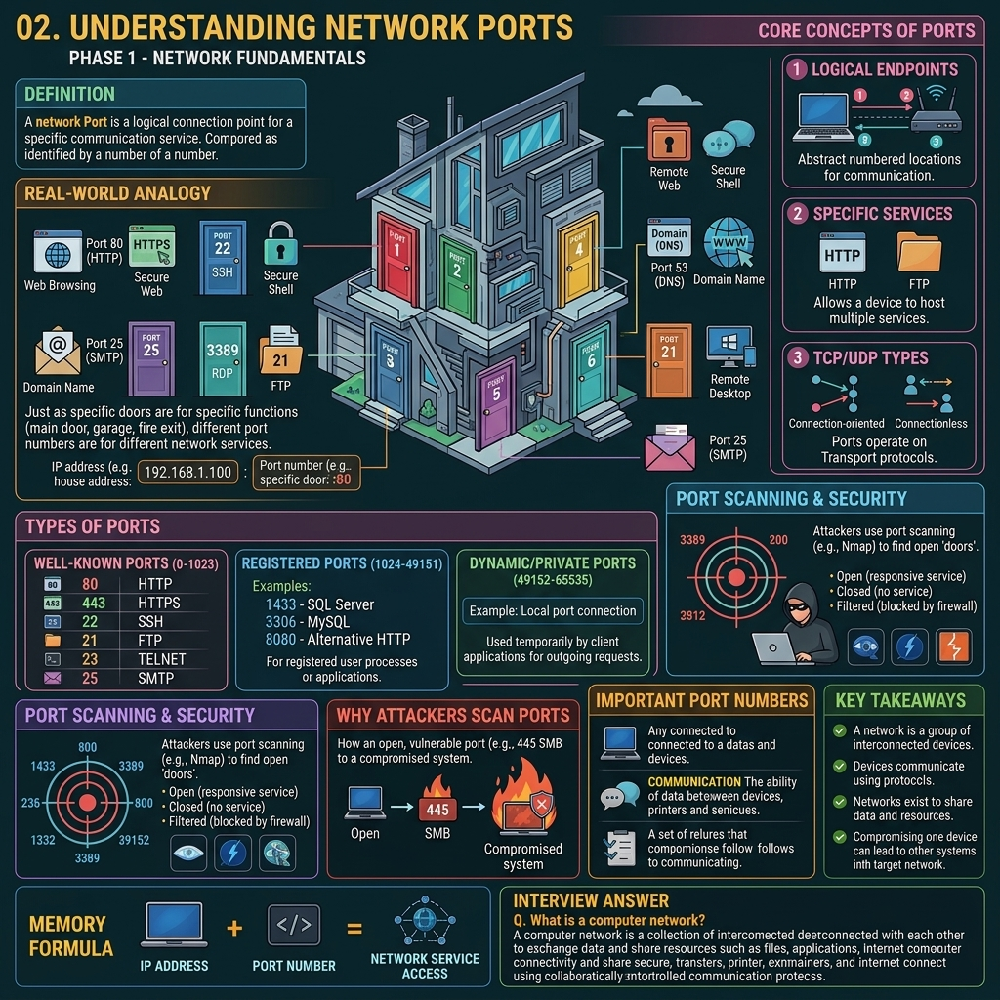

# Phase 1 — Networking Fundamentals



# Concept 5: Network Ports

## Definition

A network port is a logical endpoint for communication in an operating system. While an IP address identifies a specific machine on a network, a port identifies a specific application or service running on that machine.

Ports are associated with IP addresses to form a **Socket** (e.g., `192.168.1.10:80`), which allows network traffic to be directed to the correct process.

---

## Real-World Analogy

Think of a large apartment building.
* The **IP Address** is the building's street address (gets you to the right building).
* The **Port Number** is the specific apartment number (gets you to the right person/service).

If you want to deliver mail to the web server, you send it to Apartment 80. If you want to securely log in to the server, you go to Apartment 22.

---

## Types of Ports

Port numbers range from **0 to 65535** and are divided into three categories:

### 1. Well-Known Ports (0 - 1023)
Reserved for standard, universally recognized services.
* **21**: FTP (File Transfer Protocol)
* **22**: SSH (Secure Shell)
* **23**: Telnet
* **25**: SMTP (Simple Mail Transfer Protocol)
* **53**: DNS (Domain Name System)
* **80**: HTTP (Web traffic)
* **443**: HTTPS (Secure Web traffic)
* **3389**: RDP (Remote Desktop Protocol)

### 2. Registered Ports (1024 - 49151)
Used by specific applications and software vendors (e.g., databases).
* **1433**: Microsoft SQL Server
* **3306**: MySQL Database
* **8080**: Alternative HTTP

### 3. Dynamic / Private Ports (49152 - 65535)
Used temporarily by clients when they initiate an outbound connection to a server.

---

## VAPT Perspective

In Vulnerability Assessment and Penetration Testing (VAPT), port scanning is one of the most critical reconnaissance steps.

Attackers and pentesters use tools like **Nmap** to scan a target's IP address to find:
* **Open Ports:** Services that are listening and potentially vulnerable.
* **Closed Ports:** No service is listening.
* **Filtered Ports:** A firewall is blocking the traffic.

If an attacker finds port 445 (SMB) open, they might attempt exploits like EternalBlue. If they find port 22 (SSH) open, they might attempt a brute-force attack.

---

## Key Takeaways

* Ports distinguish between different network services running on the same host.
* Port numbers range from 0 to 65535.
* Well-known ports (0-1023) are used for standard protocols like HTTP, SSH, and DNS.
* Port scanning is the primary method used by attackers to discover what services a target is running.

---

## Memory Formula

```text
IP Address (Machine) + Port (Service) = Socket
```

---

## Interview Answer

**What is a network port?**

A network port is a virtual, logical endpoint for communication that identifies a specific application or service on a computer. While an IP address routes traffic to the correct machine, the port number ensures the traffic is delivered to the correct program, such as port 80 for a web server or port 22 for SSH.
