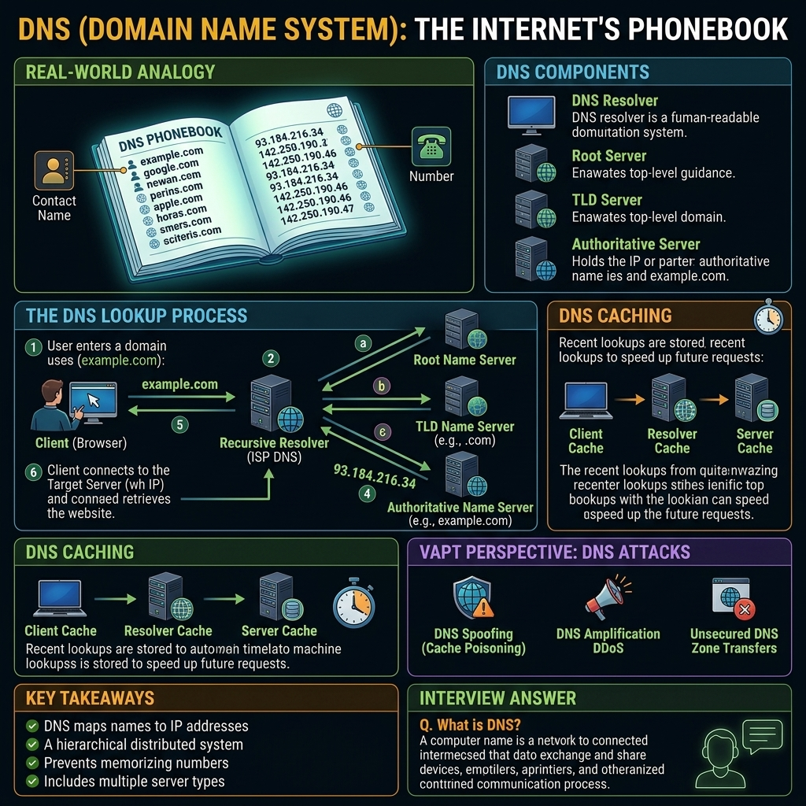

# Phase 1 — Networking Fundamentals



# Concept 6: DNS (Domain Name System)

## Definition and Core Concepts

Computers communicate over networks using IP addresses (e.g., `142.250.190.46`). However, human beings are terrible at remembering seemingly random strings of numbers. Humans prefer readable names (e.g., `google.com`).

The **Domain Name System (DNS)** is the phonebook of the internet. It is a hierarchical, decentralized naming system that translates human-readable domain names into the machine-readable IP addresses required for network routing.

When you type `www.amazon.com` into your browser, DNS is the protocol that answers the question behind the scenes: *"What is the IP address for www.amazon.com?"*

---

## The DNS Hierarchy

DNS operates in a strict top-down hierarchy. No single server holds the entire internet's phonebook. Instead, the responsibility is delegated.

1. **The Root Level (`.`):** The absolute top of the hierarchy. There are 13 logical root server clusters globally (named A through M). They don't know the IP of `amazon.com`, but they know who controls the `.com` domains.
2. **Top-Level Domains (TLDs):** The TLD servers handle extensions like `.com`, `.org`, `.net`, `.edu`, and country codes like `.uk` or `.in`.
3. **Second-Level Domains:** These are the actual domain names registered by organizations (e.g., `amazon.com`, `wikipedia.org`). They are managed by the organization's Authoritative Name Servers.
4. **Subdomains (Third-Level):** Branches within a domain (e.g., `www.amazon.com`, `aws.amazon.com`).

---

## The DNS Resolution Process

When a user requests a website, a complex, split-second query process occurs.

### Step 1: The Local Cache
Before asking the internet, your computer checks its own local DNS cache. If you visited the site recently, the IP address is already saved. (On Windows, view this with `ipconfig /displaydns`). If not found, it checks the local `hosts` file.

### Step 2: The Recursive Resolver (ISP DNS)
If the local cache misses, your computer sends the query to a **Recursive Resolver**. This is usually provided by your Internet Service Provider (ISP) or a public DNS provider (like Google's `8.8.8.8` or Cloudflare's `1.1.1.1`). 
The recursive resolver acts as your middleman. It says, *"I don't know the IP, but I will find out for you."*

### Step 3: Querying the Root Server
The recursive resolver asks a Root DNS server: *"Where is www.amazon.com?"*
The Root server replies: *"I don't know, but here is the IP for the `.com` TLD server."*

### Step 4: Querying the TLD Server
The recursive resolver asks the `.com` TLD server: *"Where is amazon.com?"*
The TLD server replies: *"I don't know the exact IP, but here are the Authoritative Name Servers for amazon.com (e.g., ns1.awsdns.com)."*

### Step 5: Querying the Authoritative Name Server
The recursive resolver asks Amazon's authoritative server: *"What is the IP for www.amazon.com?"*
The authoritative server checks its records and replies with the final IP address (e.g., `54.239.28.85`).

### Step 6: Return and Cache
The recursive resolver returns the IP address to your computer and caches it so it doesn't have to repeat this process for the next user. Your browser then initiates a TCP connection to `54.239.28.85`.

---

## Common DNS Record Types

DNS holds more than just basic IP addresses. It uses different "Record Types" for different services.

* **A Record (Address):** Maps a domain name to an IPv4 address. (The most common record).
* **AAAA Record:** Maps a domain name to an IPv6 address.
* **CNAME (Canonical Name):** Maps a domain to another domain (an alias). For example, `blog.example.com` might be a CNAME pointing to `example.wordpress.com`.
* **MX (Mail Exchange):** Directs email to the correct mail servers for a domain. If you send an email to `@google.com`, DNS checks the MX record to find Google's mail server IP.
* **TXT (Text):** Allows administrators to insert arbitrary text into DNS. Originally used for notes, it is now critically used for email security (SPF, DKIM, DMARC) and domain ownership verification.
* **NS (Name Server):** Indicates which DNS server is authoritative for a domain.
* **PTR (Pointer):** Used for Reverse DNS lookups (resolving an IP address back into a domain name).

---

## VAPT Perspective: DNS Attacks and Enumeration

DNS is a goldmine for penetration testers and a massive attack surface for threat actors.

### 1. DNS Reconnaissance (Subdomain Enumeration)
Before attacking a company, a pentester must find all their internet-facing assets. Since companies hide internal portals or staging servers on subdomains (e.g., `dev.vpn.company.com`), finding them is critical.
* **Brute Forcing:** Tools like `Amass`, `Sublist3r`, or `Gobuster` guess thousands of subdomains against a domain's DNS server to see which ones resolve to an IP.
* **Zone Transfers (AXFR):** A Zone Transfer is a mechanism intended for DNS servers to sync their databases. If misconfigured, an attacker can request a zone transfer and download the *entire* DNS record database for a company instantly.

### 2. DNS Spoofing / Cache Poisoning
An attacker intercepts DNS requests and replies with a fake IP address before the legitimate DNS server can respond. 
* Result: The victim types `bank.com` into their browser, but DNS Spoofing redirects them to the attacker's phishing server `192.168.1.99`. The browser bar will still display `bank.com`, making the attack highly convincing.

### 3. DNS Tunneling
Because DNS traffic (Port 53) is almost never blocked by corporate firewalls (otherwise the internet breaks), attackers use it to bypass firewalls and exfiltrate data.
* An attacker creates a custom authoritative DNS server for `attacker.com`.
* Malware on the inside network encodes stolen data (like a password) into a DNS query: `password123.attacker.com`.
* The firewall allows the query out. The attacker's DNS server logs the query, effectively extracting the password.

### 4. DNS Amplification (DDoS)
An attacker spoofs the victim's IP address and sends a massive volume of DNS queries to vulnerable public DNS servers. The queries ask for large amounts of data (like `ANY` records). The DNS servers respond to the spoofed IP (the victim) with massive payloads, amplifying the attacker's bandwidth and overwhelming the victim's network.

---

## Troubleshooting and CLI Tools

Security analysts must be proficient with DNS command-line tools.

### 1. nslookup
A basic tool available on Windows and Linux for querying DNS.
```bash
nslookup google.com
# Querying a specific server (e.g., Google's 8.8.8.8)
nslookup google.com 8.8.8.8
```

### 2. dig (Domain Information Groper)
The industry standard on Linux for advanced DNS queries.
```bash
# Basic A record lookup
dig google.com

# Request specific record types (e.g., MX records)
dig MX google.com

# Attempt a Zone Transfer (AXFR)
dig axfr @ns1.target.com target.com
```

### 3. hosts File
The local `hosts` file on an operating system bypasses DNS entirely. If an entry exists in the `hosts` file, the OS will never query the network.
* **Linux/Mac:** `/etc/hosts`
* **Windows:** `C:\Windows\System32\drivers\etc\hosts`
* Malware often modifies this file to redirect security update domains (e.g., `windowsupdate.microsoft.com`) to `127.0.0.1` so the machine cannot update.

---

## Key Takeaways

* DNS translates human-readable domain names into machine-readable IP addresses.
* It is a hierarchical system (Root -> TLD -> Authoritative).
* Recursive resolvers (like your ISP's DNS) do the heavy lifting of querying the hierarchy on your behalf.
* Different Record Types serve different purposes (A for IPv4, MX for email, TXT for security/verification).
* In VAPT, DNS is the primary tool for Subdomain Enumeration.
* Misconfigured DNS servers allow Zone Transfers, leaking the entire infrastructure map.
* DNS operates primarily on **UDP Port 53** for speed, but uses **TCP Port 53** for large payloads (like Zone Transfers).

---

## Memory Formula

```text
Domain Name (google.com) --> DNS Resolver --> IP Address (142.250.190.46)
DNS = The Internet's Phonebook
```

---

## Interview Questions & Answers

**Q: Explain the difference between an A record and a CNAME record.**
**A:** An 'A' (Address) record maps a domain name directly to an IPv4 address. A 'CNAME' (Canonical Name) record maps a domain name to another domain name (an alias). For example, `shop.example.com` might have a CNAME pointing to `example.myshopify.com`. The DNS resolver must then perform a second lookup on the CNAME target to ultimately find the IP address.

**Q: Why does DNS use UDP instead of TCP?**
**A:** DNS primarily uses UDP because speed is critical for web browsing, and the payload of a standard DNS query and response is small enough to fit within a single UDP packet (under 512 bytes). Establishing a TCP 3-way handshake for every DNS query would introduce unacceptable latency. However, DNS will fall back to TCP if the response is truncated (exceeds 512 bytes) or for administrative tasks like Zone Transfers (AXFR).

**Q: What is a DNS Zone Transfer and why is it a security risk?**
**A:** A Zone Transfer (AXFR) is a mechanism used by DNS administrators to replicate DNS databases between primary and secondary name servers. It is a security risk if the primary server is misconfigured to allow zone transfers from *any* IP address. An attacker can request a zone transfer and download the entire DNS zone file, instantly revealing all subdomains, internal hostnames, and IP addresses associated with the organization, bypassing the need for slow subdomain brute-forcing.
