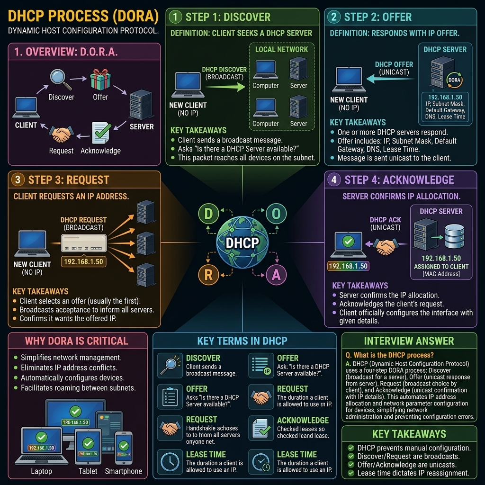

# Phase 1 — Networking Fundamentals

<<<<<<< HEAD
# Concept 7: DHCP (Dynamic Host Configuration Protocol)

## Definition

DHCP automatically assigns network configuration to devices connected to a network.

Without DHCP, you would have to manually configure:

* IP address
* Subnet mask
* Default gateway
* DNS server

---

# Why Do We Need DHCP?

Suppose 200 employees join a company's Wi-Fi. Assigning IP addresses manually would be inefficient.

DHCP automates the process.

---

# DHCP Process (DORA)

## Step 1: Discover

The client broadcasts:

```text
"Is there any DHCP server?"
=======


# Concept 7: DHCP (Dynamic Host Configuration Protocol)

## Definition and Purpose

In the early days of networking, every computer had to be manually configured by a network administrator. They had to manually type in an IP address, a subnet mask, a default gateway, and DNS servers. This is called **Static IP Assignment**. As networks grew to hundreds or thousands of devices—and with the advent of mobile devices constantly joining and leaving networks—manual configuration became impossible to maintain.

**DHCP (Dynamic Host Configuration Protocol)** solves this problem. It is an application-layer protocol that automatically and dynamically assigns IP addresses and other critical network parameters to devices as they connect to the network.

When you connect your phone to a coffee shop's Wi-Fi and instantly have internet access, DHCP is the protocol working behind the scenes to configure your network stack in milliseconds.

DHCP operates on a Client-Server model, utilizing **UDP Ports 67 (Server) and 68 (Client)**.

---

## The D.O.R.A. Process

When a new device (a client) connects to a network and is configured to obtain an IP automatically, it initiates a four-step negotiation process with a DHCP server. This process is easily remembered by the acronym **D.O.R.A.**.

### 1. Discover (Client -> Server)
Because the client has just joined the network, it does not have an IP address, nor does it know the IP address of the DHCP server. 
* The client sends a **DHCP Discover** packet.
* **Source IP:** `0.0.0.0` (Because it has no IP yet).
* **Destination IP:** `255.255.255.255` (The universal broadcast address).
* **Meaning:** The client is shouting to the entire local network: *"Help! I am new here. Is there a DHCP server that can give me an IP address?"*

### 2. Offer (Server -> Client)
Any active DHCP server on the local network hears the broadcast. 
* The server looks at its pool of available IP addresses (its scope) and selects an available IP.
* The server sends a **DHCP Offer** packet back to the client. This packet is usually broadcasted or sent via unicast to the client's MAC address.
* **Payload:** The offer contains the proposed IP address, subnet mask, default gateway, DNS servers, and the lease duration.
* **Meaning:** *"I am a DHCP server. I can offer you the IP address 192.168.1.50 for the next 24 hours."*

### 3. Request (Client -> Server)
In some enterprise networks, there may be multiple DHCP servers for redundancy, meaning the client might receive multiple Offers.
* The client selects one offer (usually the first one it received) and broadcasts a **DHCP Request** packet.
* The client broadcasts this request rather than sending it directly to the server. Why? So that *all* other DHCP servers on the network hear it and know that their offers were rejected, allowing them to return those IPs to their available pools.
* **Meaning:** *"Thank you, Server A. I accept your offer for 192.168.1.50. Other servers, please cancel your offers."*

### 4. Acknowledge (Server -> Client)
* The chosen DHCP server finalizes the transaction by sending a **DHCP Acknowledge (ACK)** packet.
* The server marks the IP address as "leased" in its database so it won't give it to anyone else.
* The client receives the ACK, configures its network interface with the provided parameters, and can now communicate on the network.
* **Meaning:** *"Confirmed. 192.168.1.50 is yours for the next 24 hours. Here is the final configuration data."*

---

## DHCP Leases and Renewal

DHCP does not permanently give away IP addresses; it **leases** them. 

A DHCP Lease has a specific duration (e.g., 8 hours, 24 hours, or 7 days). This mechanism is crucial for network hygiene. If a customer leaves a coffee shop, their IP address shouldn't be reserved for them forever. The lease expires, and the IP is returned to the pool for the next customer.

**The Renewal Process:**
To prevent active devices from losing their IP addresses, clients automatically attempt to renew their leases before they expire.
* At **50% of the lease time** (T1 timer), the client sends a unicast DHCP Request directly to the server asking to extend the lease. If the server is up, it sends an ACK, and the timer resets.
* If the server is down, the client keeps using the IP. At **87.5% of the lease time** (T2 timer), the client enters a panic state and broadcasts a DHCP Request to the entire network, hoping *any* DHCP server will renew the lease.
* If the lease expires completely (100%), the client must immediately stop using the IP address and restart the DORA process from scratch.

---

## DHCP Scopes and Reservations

Administrators configure DHCP servers using specific concepts:

* **Scope / Pool:** The range of IP addresses the server is allowed to distribute (e.g., `192.168.1.100` to `192.168.1.200`).
* **Exclusions:** Specific IPs within the scope that the server should never distribute (perhaps they are manually assigned to printers or switches).
* **Reservations (Static DHCP):** Tying a specific IP address to a specific MAC address. Every time a specific manager's laptop connects, the DHCP server recognizes their MAC address and always gives them the exact same IP (e.g., `192.168.1.50`).

---

## VAPT Perspective: DHCP Attacks

Because DHCP fundamentally relies on unauthenticated broadcast traffic (anyone can shout on the network), it is a prime target for local network exploitation.

### 1. DHCP Starvation Attack
An attacker floods the local network with thousands of fake DHCP Discover messages. 
* To prevent the DHCP server from recognizing that the requests are coming from a single attacker, the attacker constantly randomizes the source MAC address in the packets.
* The DHCP server blindly hands out IP addresses to these fake MAC addresses until its entire pool is depleted.
* **Result:** A Denial of Service (DoS). Legitimate new devices joining the network cannot obtain an IP address and are completely blocked from network communication.
* **Tool:** `Yersinia` is a classic pentesting tool for executing this attack.

### 2. Rogue DHCP Server & MitM
Often paired with a Starvation attack, once the legitimate DHCP server is depleted (or if the attacker simply responds to DHCP Discovers faster), the attacker spins up their own malicious "Rogue" DHCP server on the local network.
* When a victim connects, the attacker's Rogue DHCP server answers the DORA process.
* The attacker assigns the victim a valid IP, but provides a malicious **Default Gateway** or **DNS Server** pointing to the attacker's own machine.
* **Result:** A catastrophic Man-in-the-Middle (MitM) attack. All of the victim's internet-bound traffic is routed through the attacker's machine, allowing the attacker to sniff credentials, downgrade encryption, or redirect DNS requests to phishing sites.
* **Mitigation:** Enterprise switches use a feature called **DHCP Snooping**, which allows administrators to designate specific switch ports as "Trusted" (connected to the real DHCP server) and blocks DHCP Offer packets originating from any "Untrusted" ports.

---

## APIPA (Automatic Private IP Addressing)

What happens if a client is configured for DHCP, but the DHCP server is offline, and no Offers are received?

Instead of having no network connection, the operating system will fall back to **APIPA**. The OS automatically assigns itself a random IP address in the `169.254.x.x` range (with a `/16` subnet mask).

* Devices with APIPA addresses can communicate with *other* devices on the same local network that also have APIPA addresses.
* However, because there is no Default Gateway assigned, they **cannot access the internet**.
* **Troubleshooting tip:** If a user complains about no internet, and you see their IP is `169.254.X.X`, you immediately know the problem is DHCP failure, not a physical cable issue.

---

## Key Takeaways

* DHCP automates the assignment of IP addresses, subnet masks, default gateways, and DNS servers.
* It operates on UDP ports 67 (Server) and 68 (Client).
* The connection process is represented by D.O.R.A.: Discover, Offer, Request, Acknowledge.
* IP addresses are leased temporarily, not assigned permanently, and must be renewed by the client.
* A Rogue DHCP server attack allows an attacker to alter the victim's default gateway/DNS, leading to total traffic interception (MitM).
* If DHCP fails, operating systems fall back to a `169.254.x.x` APIPA address.

---

## Memory Formula

```text
D - Discover (Client broadcasts to find a server)
O - Offer    (Server offers an IP)
R - Request  (Client formally requests the offered IP)
A - Acknowledge (Server confirms the lease)
>>>>>>> 615badecdf7661df364019b031e3bba3e24173cc
```

---

<<<<<<< HEAD
## Step 2: Offer

The DHCP server replies:

```text
"Use IP address 192.168.1.20."
```

---

## Step 3: Request

The client responds:

```text
"I want to use that IP."
```

---

## Step 4: Acknowledge

The server confirms:

```text
"The IP address is now assigned."
```

---

# DORA Flow

```text
Client                DHCP Server

Discover ---------->

          <---------- Offer

Request ----------->

          <---------- Acknowledge
```

---

# Common Ports

| Protocol    | Port |
| ----------- | ---- |
| DHCP Server | 67   |
| DHCP Client | 68   |

DHCP uses UDP.

---

# VAPT Perspective

Misconfigured DHCP servers can:

* Assign incorrect network settings.
* Enable rogue DHCP attacks.
* Redirect users to malicious DNS servers.

---

# Memory Trick

```text
DORA

D → Discover
O → Offer
R → Request
A → Acknowledge
```

---

# Interview Answer

DHCP automatically assigns IP addresses and other network settings to devices. It uses the DORA process and operates on UDP ports 67 and 68.
=======
## Interview Questions & Answers

**Q: Explain the DORA process in DHCP.**
**A:** DORA stands for Discover, Offer, Request, and Acknowledge. When a client joins a network, it broadcasts a DHCP Discover packet to find a server. A DHCP server responds with a DHCP Offer containing a proposed IP address. The client then broadcasts a DHCP Request to formally request that specific IP address and reject any other offers. Finally, the server sends a DHCP Acknowledge to confirm the lease and provide final network configuration parameters like the subnet mask and default gateway.

**Q: How does a Rogue DHCP Server attack work?**
**A:** A Rogue DHCP server attack involves an attacker placing an unauthorized DHCP server on the local network. Because DHCP relies on broadcast traffic without authentication, the rogue server attempts to respond to client DHCP Discover requests faster than the legitimate server. The rogue server assigns the victim an IP address but maliciously configures the Default Gateway or DNS server to point to the attacker's machine. This routes all the victim's external traffic through the attacker, enabling a Man-in-the-Middle (MitM) attack.

**Q: You check a user's computer and their IP address is 169.254.10.5. What does this mean?**
**A:** This is an APIPA (Automatic Private IP Addressing) address. It means the computer is configured to obtain an IP address automatically via DHCP, but it was unable to reach a DHCP server on the network. The operating system assigned this fallback address. The computer can communicate locally with other APIPA devices but cannot reach the internet because it has no default gateway.
>>>>>>> 615badecdf7661df364019b031e3bba3e24173cc
