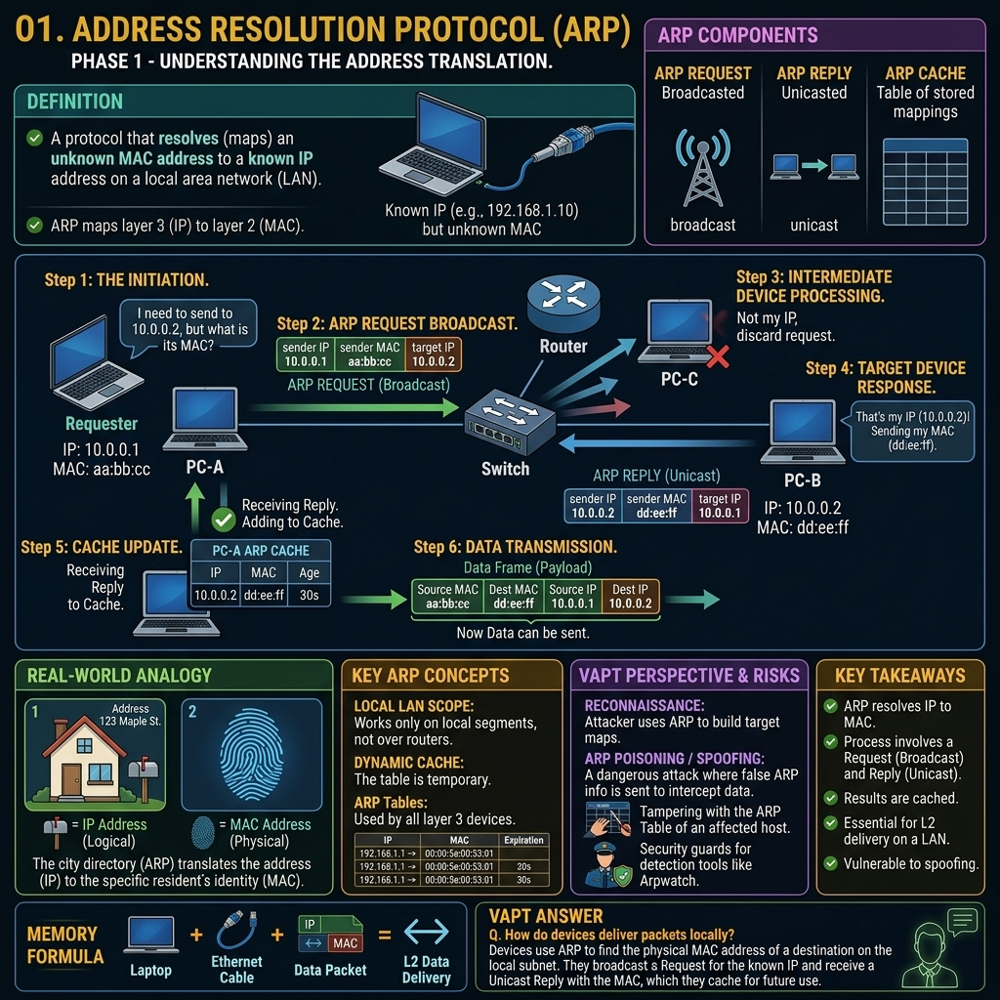

# Phase 1 — Networking Fundamentals



# Concept 8: ARP (Address Resolution Protocol)

## Definition and the Two-Address Problem

In computer networking, communication relies on two fundamentally different types of addresses operating at different layers of the OSI model:

1. **Logical Addresses (Layer 3 - Network Layer):** The **IP Address**. This is a hierarchical, routable address (like a zip code). It dictates how data traverses across the internet, hopping from router to router to reach the correct destination network.
2. **Physical Addresses (Layer 2 - Data Link Layer):** The **MAC Address**. This is a flat, permanent hardware address burned into the Network Interface Card (NIC). It dictates how data is moved across the *local* physical wire or Wi-Fi airwaves from one specific machine to another.

**The Problem:** When Application A wants to send data to Application B, it uses an IP address (e.g., "Send this HTTP request to `192.168.1.50`"). However, Ethernet switches do not understand IP addresses; they only route traffic based on MAC addresses. Therefore, the sending computer *must* know the physical MAC address of the destination computer before it can place the data on the wire.

**The Solution:** The **Address Resolution Protocol (ARP)**. ARP is the essential bridge between Layer 3 and Layer 2. Its sole purpose is to translate a known IP address into an unknown MAC address on a local area network (LAN).

---

## How ARP Works: The Resolution Process

When a computer (Host A) wants to send a packet to another computer (Host B) on the same local network, it goes through a specific sequence of steps.

### Step 1: The ARP Cache Check
ARP requests generate network traffic. To avoid flooding the network every time a packet is sent, operating systems maintain an internal memory table called the **ARP Cache** (or ARP Table). This table temporarily stores recent IP-to-MAC mappings.
* Host A checks its ARP cache: *"Do I already have the MAC address for 192.168.1.50?"*
* If **Yes**, it uses the MAC address, builds the Ethernet frame, and sends the data immediately.
* If **No**, it must initiate an ARP Resolution process.

### Step 2: The ARP Request (Broadcast)
Since Host A doesn't know the MAC address, it must ask everyone on the network.
* Host A creates an **ARP Request** packet.
* **Target IP:** `192.168.1.50`
* **Target MAC:** `FF:FF:FF:FF:FF:FF` (The Layer 2 Broadcast address).
* The network switch receives this broadcast frame and blindly copies it to *every single port* on the switch. 
* **Meaning:** *"Attention everyone! I am looking for the device holding the IP address 192.168.1.50. If that is you, please reply to me and tell me your MAC address."*

### Step 3: The ARP Reply (Unicast)
Every device on the local network receives the broadcast and looks at the Target IP inside the packet.
* Devices with different IP addresses (e.g., `192.168.1.100`) look at the packet, realize it isn't meant for them, and silently drop it.
* Host B (who owns `192.168.1.50`) sees the packet and generates an **ARP Reply**.
* Because Host B now knows Host A's MAC address (from the incoming request), it sends the reply directly back to Host A via **Unicast** (not broadcast).
* **Meaning:** *"Hello Host A, I am 192.168.1.50. My MAC address is 00:1A:2B:3C:4D:5E."*

### Step 4: Updating the Cache and Transmitting
* Host A receives the reply and immediately updates its ARP Cache with the new mapping.
* Host A can now encapsulate the original IP packet inside a Layer 2 Ethernet frame addressed to `00:1A:2B:3C:4D:5E` and send the actual application data.

---

## ARP and Remote Networks (The Default Gateway)

What happens if Host A (`192.168.1.10`) wants to send data to a server on the internet, like Google (`142.250.190.46`)?

Host A knows that `142.250.190.46` is not on its local subnet (by checking its subnet mask). **ARP does not cross routers; it only works on the local network.** Therefore, Host A cannot send an ARP request for Google's IP.

Instead, Host A must send the packet to its **Default Gateway** (the local router).
1. Host A checks its routing table and determines the IP of the Default Gateway (e.g., `192.168.1.1`).
2. Host A checks its ARP cache for the MAC address of `192.168.1.1`.
3. If not found, Host A sends an ARP Request asking: *"Who has 192.168.1.1?"*
4. The router replies with its MAC address.
5. Host A packages the data. The **Destination IP** is Google (`142.250.190.46`), but the **Destination MAC** is the Router's MAC address.
6. The router receives the frame, strips off the MAC address, looks at the IP address, and forwards it to the next hop on the internet.

---

## VAPT Perspective: ARP Exploitation

ARP was designed in the 1980s with a focus on functionality, not security. It has a fundamental flaw: **It operates entirely on trust.** ARP includes no mechanisms for authentication or verification. 

### ARP Spoofing / ARP Poisoning
Because ARP is stateless and trusting, a device will accept an ARP Reply *even if it never sent an ARP Request*. Furthermore, if it receives an ARP Reply that contradicts its current cache, it will overwrite the old, valid entry with the new, malicious entry.

This allows for trivial **Man-in-the-Middle (MitM)** attacks via ARP Poisoning.

**The Attack Scenario:**
1. **The Setup:** Victim is `192.168.1.50`. Router is `192.168.1.1`. Attacker is `192.168.1.99`.
2. **Poisoning the Victim:** The attacker sends a continuous stream of forged, unsolicited ARP Replies to the Victim. The payload says: *"Hey, the Router (192.168.1.1) is now located at my MAC address (Attacker's MAC)."* The Victim updates its ARP cache.
3. **Poisoning the Router:** Simultaneously, the attacker sends forged ARP Replies to the Router: *"Hey, the Victim (192.168.1.50) is now located at my MAC address (Attacker's MAC)."* The Router updates its cache.
4. **The Interception:** Now, when the Victim tries to browse the internet, it sends the traffic to the Attacker's MAC address. The Attacker captures the packets (using Wireshark), reads or modifies them, and then forwards them to the real Router so the Victim doesn't realize the connection is broken. The return traffic follows the same compromised path.
5. **Tools:** `Ettercap`, `Bettercap`, and `arpspoof` are commonly used for this.

**Mitigation:**
To stop ARP spoofing, enterprise networks use **Dynamic ARP Inspection (DAI)** on their switches. DAI intercepts all ARP packets and checks them against a trusted database (usually the DHCP snooping binding database). If an ARP packet claims an IP-to-MAC mapping that doesn't match the database, the switch drops the packet and logs an alert.

---

## CLI Tools and Troubleshooting

As a security professional, you must know how to manipulate the ARP cache on your machine.

**Windows & Linux Commands:**
* **View the ARP Table:** 
  ```bash
  arp -a
  ```
  *(Look for duplicate MAC addresses assigned to different IPs—this is a primary indicator you are being ARP spoofed!)*

* **Delete an ARP Entry (Force a refresh):**
  ```bash
  arp -d 192.168.1.50
  ```

* **Add a Static ARP Entry (Mitigates spoofing for a specific IP):**
  ```bash
  arp -s 192.168.1.1 00-1A-2B-3C-4D-5E
  ```
  *(Setting a static entry for the Default Gateway ensures an attacker cannot overwrite it via spoofing).*

---

## Key Takeaways

* ARP resolves Layer 3 Logical IP addresses to Layer 2 Physical MAC addresses.
* It is strictly a local-network protocol; ARP requests are broadcasts and do not cross routers.
* When communicating with the internet, ARP is used to find the MAC address of the Default Gateway (router), not the remote server.
* The ARP process consists of a Broadcast Request and a Unicast Reply.
* Operating systems maintain an ARP Cache to improve network efficiency.
* Because ARP lacks authentication, it is highly vulnerable to ARP Spoofing, leading to Man-in-the-Middle attacks.

---

## Memory Formula

```text
ARP = "Hey Network, who has this IP? Tell me your MAC!"
Layer 3 (IP) ---> ARP ---> Layer 2 (MAC)
```

---

## Interview Questions & Answers

**Q: Explain how ARP resolves an IP address to a MAC address.**
**A:** When a device needs to communicate with an IP address on its local network, it first checks its internal ARP cache. If the MAC address is not found, it sends a Layer 2 broadcast frame containing an ARP Request, essentially asking, "Who has this IP address?" The device that owns that IP address receives the broadcast and replies directly via unicast with an ARP Reply containing its MAC address. The originating device updates its ARP cache and can now send the data frame.

**Q: If you ping `google.com` (142.250.190.46), does your computer send an ARP request for Google's IP?**
**A:** No. ARP only operates on the local broadcast domain. Your computer's network stack compares Google's IP address against its own IP and subnet mask, determining that Google is on a remote network. Therefore, it consults its routing table and sends an ARP request for the IP address of its Default Gateway (the local router). It then encapsulates the IP packet destined for Google inside an Ethernet frame addressed to the router's MAC address.

**Q: What is ARP Spoofing and how can it be mitigated?**
**A:** ARP Spoofing (or Poisoning) is an attack where a malicious actor sends forged, unsolicited ARP Reply messages to a victim. Because ARP is stateless and lacks authentication, the victim accepts the forged replies and overwrites its ARP cache, associating the attacker's MAC address with a legitimate IP address (usually the Default Gateway). This allows the attacker to intercept, read, or alter traffic in a Man-in-the-Middle attack. It can be mitigated on enterprise networks by implementing Dynamic ARP Inspection (DAI) on switches, or on individual hosts by using static ARP entries.
