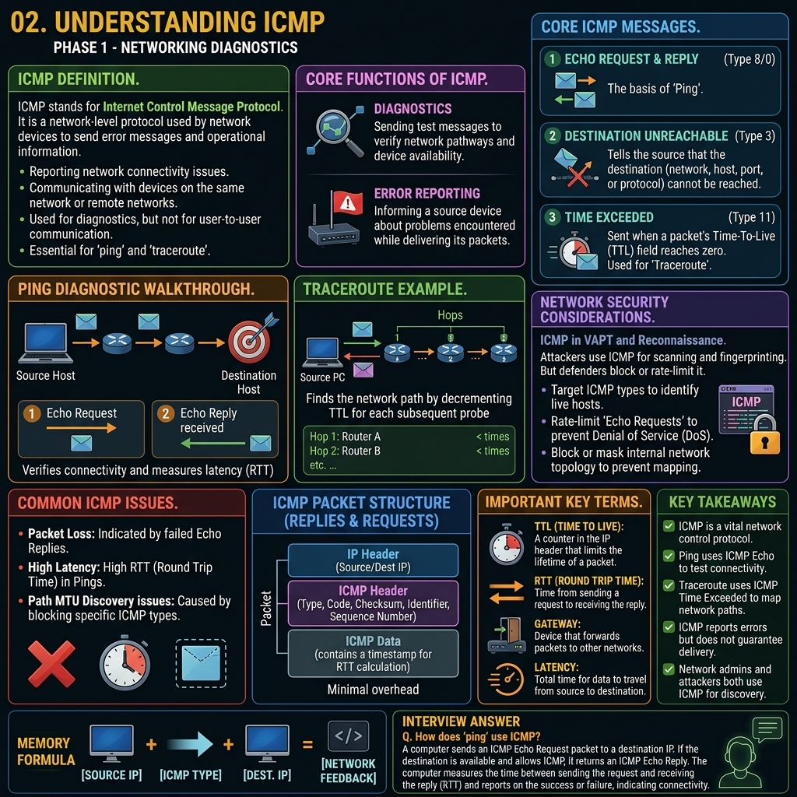

# Phase 1 — Networking Fundamentals



# Concept 9: ICMP (Internet Control Message Protocol)

## Definition

ICMP is a network-layer protocol used by network devices to send error messages and operational information indicating success or failure when communicating with another IP address. 

Unlike TCP and UDP, ICMP is not used to exchange data between applications. Instead, it is the internet's diagnostic and reporting tool.

---

## Core Tools Utilizing ICMP

### 1. Ping
The `ping` command is the most famous use of ICMP. It tests whether a destination host is reachable and measures the round-trip time (latency).
* The sender sends an **ICMP Echo Request** (Type 8).
* The receiver replies with an **ICMP Echo Reply** (Type 0).

### 2. Traceroute
The `traceroute` (or `tracert`) command tracks the pathway a packet takes from source to destination. It intentionally uses low Time-To-Live (TTL) values. When a router drops a packet because the TTL expired, it sends back an **ICMP Time Exceeded** message, revealing the router's IP address.

---

## Common ICMP Message Types

* **Type 0:** Echo Reply (Pong)
* **Type 3:** Destination Unreachable (A router couldn't find a path to the destination, or a firewall blocked it).
* **Type 8:** Echo Request (Ping)
* **Type 11:** Time Exceeded (Packet died in transit, used in traceroute).

---

## VAPT Perspective

ICMP is a double-edged sword. It is essential for network administrators to diagnose issues, but attackers also use it heavily during the reconnaissance phase.

* **Ping Sweeps:** Attackers send ICMP Echo Requests to an entire subnet (e.g., `192.168.1.0/24`) to quickly identify which hosts are alive and online.
* **Firewall Evasion:** Sometimes, firewalls block TCP/UDP ports but mistakenly allow ICMP. Attackers can use ICMP tunneling to exfiltrate data.
* **Ping of Death / Smurf Attacks:** Legacy DoS attacks exploited ICMP to overwhelm target networks.
* **Security Practice:** Many modern networks configure firewalls to drop incoming ICMP Echo Requests to hide their presence from external attackers.

---

## Key Takeaways

* ICMP is a diagnostic protocol, not a data transport protocol.
* It powers essential network tools like Ping and Traceroute.
* ICMP provides error reporting, such as "Destination Unreachable."
* Attackers use ICMP for network mapping (host discovery), which is why many organizations block external ICMP traffic.

---

## Memory Formula

```text
Ping = ICMP Type 8 (Request) -> ICMP Type 0 (Reply)
```

---

## Interview Answer

**What is the purpose of ICMP?**

ICMP (Internet Control Message Protocol) is used primarily for network diagnostics and error reporting. It does not carry application data; instead, it generates messages like "Destination Unreachable" or "Time Exceeded" to help administrators troubleshoot network issues. It is the underlying protocol used by standard diagnostic tools like `ping` and `traceroute`.
